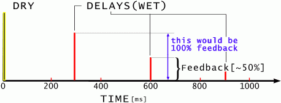
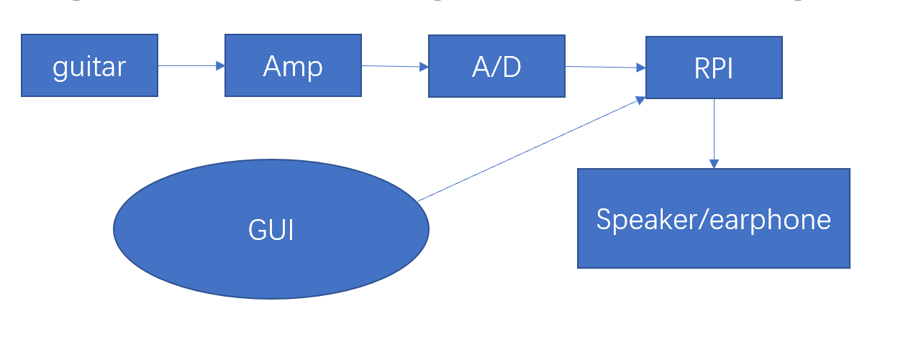
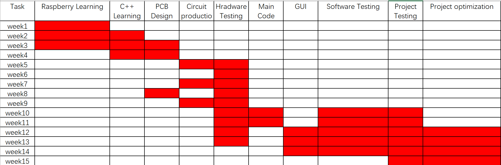

# RPI_AMP

## Introduction  
This is an open source real time embedded project based on raspberry 3 and progarmmed with C++.The aim of the project is that providing an intelligent,portable and extensible RPI_AMP,especiall for music-lovers.In our project ,we designed four different functions and users could choose any one on the GUI. Meanwhile, users could change the degree of the effect based on the knobs.
## Hardware
What this project need is a electric guitar(a acoustic guitar with pizeo pickups may also work, but not tested),two cables and a speaker(any kinds of speaker is OK). 
## Electronics
There are 3 PCBs in the RPI_AMP. 

## Effects
### Effect1:Distortion
In the tube amps, when the tubes are working in the saturation zone, the top an botton may be flattened which is called saturation distortion. Distortion will make the signal noisy and have more sustain.In RPI_AMP we set two thresholds and then cutoff the signal to the threshold to get the distortion effect.The threshold can be changed to get different degree of distortion.
### Effect2:Delay
Delay is an audio effect.The former signal is put into a buffer and then sent out with the current signal to get the Delay effect.

### Effect3:Reverb
Reverb is simulating the effect when sound spread in a hall or a crave. The complex topographies lead to complex type of echoes.So we apply multiply echoes to simulate the reverb. The time of reverb can also be changed.
### Effect4:EQ
For the real-time EQ, Butterworth Bandstop filter is applied to change the frequency components of the signal. It can make the signal sounds darker or brighter.
## Workflow

## Gantt Chart

## Quick links
1) [Wiki page](https://github.com/LemonRepublica/RPI_AMP/wiki)  
2) [Vedio_Test](https://www.youtube.com/watch?v=wtC8RktlwYI)  
3)               
## Demonstration
1) [Function Test ](https://youtu.be/Or1FA4tJWyk)  
2) [Function Demonstration ](https://www.youtube.com/watch?v=wtC8RktlwYI) 

## Future work
There are plenty of things that can be done to improve RPI_AMP, which could be divided into two parts ,namely,hardware and software. 
1) The major limitation is that the data processing of the Raspberry pi is slow. When we try to apply some complex algorithm to the signal, the processe speed goes down which affects the sound quality. 
2) Our choice of electronic component also limits the sound quality. At the beginning we decided to use MCP3002 10 bits ADC to read the signal. However the sound quality is bad so we changed the ADC to MCP3202 12 bits. The sound is better, but not as good as professional processer. 
3) The GUI might effect the speed of the program so its hard to apply the Butterworth filter because the system frequency is changing(of cause some unexpected distortion occurs). That can be improved when we get more skills about C++ or C coding. 

